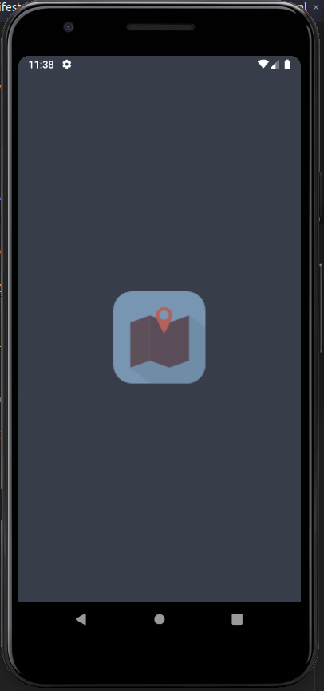
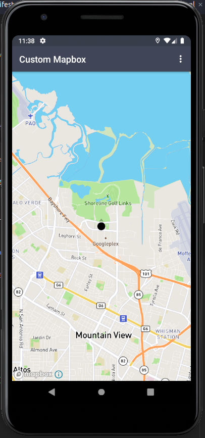
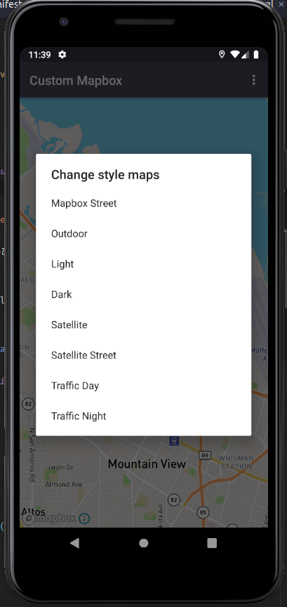

# Custom-Mapbox
Settings dependency in build.gradle(app)
```bash
implementation 'com.mapbox.mapboxsdk:mapbox-android-navigation-ui:0.30.0'
implementation('com.mapbox.mapboxsdk:mapbox-android-sdk:8.5.0') {
   exclude group: 'group_name', module: 'module_name'
}
```

Settings dependency in build.gradle(Project)
```bash
 mavenCentral()
 maven {
   url 'https://mapbox.bintray.com/mapbox'
}
```

## Preview




### Documentation
https://docs.mapbox.com/help/how-mapbox-works/access-tokens/
